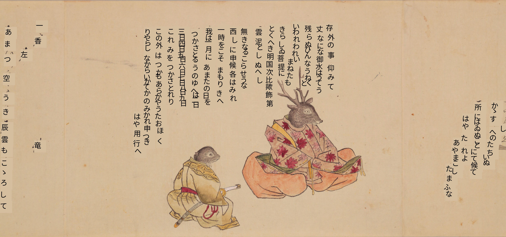

# Welcome to tkasasagi's website

My name is Tarin Clanuwat. I am a research scientist at [Sakana AI](https://sakana.ai/blog/) in Tokyo. I got my PhD in Classical Japanese Literature (文学) from Waseda University, Graduate School of Arts Letters and Science. I specialized in the Tale of Genji's commentary books from Kamakura and Nambokucho period. Previously I was a senior research scientist at Google Research, Brain team, Google DeepMind, a project assistant professor at [ROIS-DS Center for Open Data in the Humanities](http://codh.rois.ac.jp) and also a project researcher at the [National Institute of Informatics](https://www.nii.ac.jp). 

## My Research

[My Google Scholar](https://scholar.google.com/citations?user=oGpFVUUAAAAJ&hl=en&oi=ao)

### Kuzushiji Recognition Model KuroNet

Raw Image

OCR

My current research interest is mainly on Kuzushiji or pre-modern Japanese character recognition with deep learning. I also worked on datasets for machine learning such as KMNIST dataset and KaoKore dataset. I am interested in encouraging humanities researchers to use machine learning and data science in their research because the research in classical literature or history deals with a lot of data all the time.

### Kuzushiji Recognition on Mobile Phone App with Flutter

{:width="300px"}

{:width="500px"}

Because I want the model available and easy to use for everyone, I am also interested in implementing Kuzushiji recognition model with a mobile phone application. I use Flutter with server API. However I want to extend my research to on-device recognition to maximize the resource and not rely on server GPU alone.

### Datasets

I have been working on creating dataset projects.

1. [Kuzushiji Dataset](http://codh.rois.ac.jp/char-shape/)
1. [Kuzushiji-MNIST (KMNIST), Kuzushiji-49 and Kuzushiji-Kanji Dataset](https://github.com/rois-codh/kmnist)
1. [KaoKore Dataset](https://github.com/rois-codh/kaokore)
1. [Ukiyo-e Face Dataset](http://codh.rois.ac.jp/ukiyo-e/face-dataset/)
1. [Digital Typhoon Dataset](http://agora.ex.nii.ac.jp/digital-typhoon/index.html.en)

## Activities
1. [Kuzushiji Recognition Smartphone Application](https://www.jst.go.jp/kisoken/act-x/application/2020/201124/201124.html) Japan Science and Technology Agency, ACT-X AI Powered Innovation / Creation research grant (Acceptance Rate 21.9%, December 2020)
1. [End-to-end Pre-modern Japanese Kuzushiji Recognition with Deep Learning](https://kaken.nii.ac.jp/grant/KAKENHI-PROJECT-19K13085/) Japan Society for the Promotion of Science, Grants-in-Aid for Scientific Research ,Grant-in-Aid for Early-Career Scientists (April 2019 - March 2022)
1. [Kaggle Kuzushiji Recognition Competition](https://www.kaggle.com/c/kuzushiji-recognition) Host (2019)
1. [The Tadashi Yanai Initiative for Globalizing Japanese Humanities, Visiting Graduate Researcher](https://www.alc.ucla.edu/person/tarin-clanuwat/) at the University of California, Los Angeles (UCLA) (2016)

## Awards

1. [National Institute of Science and Technology Policy (NISTEP), Ministry of Education, Culture, Sports, Science and Technology](https://www.nistep.go.jp/archives/53711) ***NISTEP Researcher 2022*** (2022)
2. [Japan Society of Digital Archive](https://awards.digitalarchivejapan.org/awards/4thawards/) ***Best Platform and System award*** for Kuzushiji Recognition Application "miwo" (2022)
3. [Good Design Award 2022](https://www.g-mark.org/award/describe/54368?locale=en) for Kuzushiji Recognition Application "miwo" (2022)
4.  [Code for Japan 勝手表彰](https://prtimes.jp/main/html/rd/p/000000047.000039198.html) ***Excellent Award*** for Kuzushiji Recognition Application "miwo" (2022).
5. [Digital Archive Promotion Consortium](https://dapcon.jp/uncategorized/award2020/) ***Technical Award*** for Kuzushiji dataset research and KuroNet service (2020).
6. [Japan Society for Digital Archive](http://digitalarchivejapan.org/4611) ***Academic Award (Research Paper)*** (2020).
7. [Information Processing Society of Japan (IPSJ)](https://www.ipsj.or.jp/award/yamasita2019-detail.html) ***Yamashita Memorial Reseach Award*** (2019).
8. [Information Processing Society of Japan (IPJS) SIG Computers and Humanities Symposium](http://jinmoncom.jp/sympo2018/) ***Best Paper Award*** (2019).
9. TC11 (Reading Systems) and TC10 (Graphics Recognition) Summer School on Document Analysis and Recognition ***Excellent Award*** (2018).
10. ***Japanese Government Scholarship (MEXT)*** Embassy Recommendation (2008 ~ 2015).

## Digital Humanities and Machine Learning Papers
1. Asanobu Kitamoto, Jun Homma, <ins>Tarin Clanuwat</ins> ***Soan*** Information Processing Society of Japan SIG Humanities and Computer Symposium 2021 (December 2023)(Peer-Reviewed) 
2. Asanobu Kitamoto, Jared Hwang, Bastien Vuillod, Lucas Gautier, Yingtao Tian, <ins>Tarin Clanuwat</ins> [Digital Typhoon: Long-term Satellite Image Dataset for the Spatio-Temporal Modeling of Tropical Cyclones](https://arxiv.org/abs/2311.02665) (December 2023)(NeurIPS Dataset and Benchmark Track, Spotlight 2023)
3. <ins>Tarin Clanuwat</ins>, Asanobu Kitamoto ***資料調査のための AI くずし字認識スマホアプリ「みを」*** Information Processing Society of Japan SIG Humanities and Computer Symposium 2021 (December 2021)(Peer-Reviewed) 
4. Yingtao Tian, <ins>Tarin Clanuwat</ins>, Chikahiko Suzuki, Asanobu Kitamoto [Ukiyo-e Analysis and Creativity with Attribute and Geometry Annotation](https://arxiv.org/abs/2106.02267) Proceedings of the 11th International Conference on Computational Creativity (ICCC'21) 300-308 (September 2021)(Peer-Reviewed)
5. Alex Lamb, <ins>Tarin Clanuwat</ins>, Siyu Han, Mikel Bober-Irizar, Asanobu Kitamoto ***Predicting the Ordering of Characters in Japanese Historical Documents*** [arxiv](https://arxiv.org/abs/2106.06786)
6. Lisa Suzuki,  Rei Kawakami, <ins>Tarin Clanuwat</ins>, Asanobu Kitamoto, Toshiaki Nakazawa, Takeshi Naemura ***Sentence Boundary Estimation of Ancient Japanese Using Bi-LSTM*** Information Processing Society of Japan SIG Humanities and Computer Symposium 2020 (December 2020)(Peer-Reviewed)
7. <ins>Tarin Clanuwat</ins>, Asanobu Kitamoto ***The Evolution of Kuzushiji Recognition Research and Services*** Information Processing Society of Japan SIG Humanities and Computer Symposium 2020 (December 2020)(Peer-Reviewed)
8. Yingtao Tian, Chikahiko Suzuki, <ins>Tarin Clanuwat</ins>, Mikel Bober-Irizar, Alex Lamb, Asanobu Kitamoto [KaoKore: A Pre-modern Japanese Art Facial Expression Dataset](https://arxiv.org/abs/2002.08595), Proceedings of the 11th International Conference on Computational Creativity (ICCC'20) 415 1.422 (September 2020)(Peer-Reviewed)
9. Alex Lamb, <ins>Tarin Clanuwat</ins>, Asanobu Kitamoto [KuroNet: Regularized Residual U-Nets for End-to-End Kuzushiji Character Recognition](https://link.springer.com/article/10.1007/s42979-020-00186-z?wt_mc=Internal.Event.1.SEM.ArticleAuthorIncrementalIssue) SN Computer Science (May 2020)(Peer-reviewed) 
10. Asanobu Kitamoto, <ins>Tarin Clanuwat</ins> ***AI Kuzushiji Recognition and a Path to Full-Text Search for Historical Documents*** Bulletin of the Japan Special Libraries Association vol 300, Page 26 1.32 (May 2020)(Invited) 
11. Asanobu Kitamoto, <ins>Tarin Clanuwat</ins>, Mikel Bober-Irizar ***Kaggle Kuzushiji Recognition Competition ─ Challenges of Hosting a World-Wide Competition in the Digital Humanities*** Journal of Japanese Society for Artificial Intelligence 35(3) Page 366 1.376 (May 2020)(Invited Paper)
12. Asanobu Kitamoto, <ins>Tarin Clanuwat</ins> , Alex Lamb , Mikel Bober-Irizar ***Progress and Results of Kaggle Machine Learning Competition for Kuzushiji Recognition***  The Information Processing Society of Japan, SIG Computers and the Humanities (December 2019)(Peer-reviewed)
13. <ins>Tarin Clanuwat</ins>, Alex Lamb, Asanobu Kitamoto [KuroNet: Pre-Modern Japanese Kuzushiji Character Recognition with Deep Learning](https://arxiv.org/abs/1910.09433) The International Conference on Document Analysis and Recognition (ICDAR) (September 2019)(Peer-reviewed)
14. Asanobu Kitamoto, <ins>Tarin Clanuwat</ins>, Tomo Miyazaki, Kazuaki Yamamoto ***Analysis of Character Data: Potential and Impact of Kuzushiji Recognition by Machine Learning*** Journal of IEICE (Institute of Electronics, Information, and Communication Engineers) 102(6) 563 1.568 (June 2019)(Peer-reviewed)(Invited)
15. <ins>Tarin Clanuwat</ins> ***Kuzushiji Character Recognition with AI*** Heianchō Bungaku Kenkyū [Research into Heian-period Literature] 27 (March 2019)(Peer-reviewed)(Invited)
16. Anh Duc Le, <ins>Tarin Clanuwat</ins>, Asanobu Kitamoto [A human-inspired recognition system for pre-modern Japanese historical documents](https://arxiv.org/abs/1905.05377) IEEE Access 2019 (Peer-reviewed)
17. <ins>Tarin Clanuwat</ins>, Alex Lamb, Asanobu Kitamoto [End-to-End Pre-Modern Japanese Character (Kuzushiji) Spotting with Deep Learning](https://ipsj.ixsq.nii.ac.jp/ej/index.php?active_action=repository_view_main_item_detail&page_id=13&block_id=8&item_id=192436&item_no=1) Information Processing Society of Japan, SIG Computers and the Humanities (Peer-reviewed)(December 2018)
18. <ins>Tarin Clanuwat</ins>, Mikel Bober-Irizar, Asanobu Kitamoto, Alex Lamb, Kazuaki Yamamoto, David Ha [Deep Learning for Classical Japanese Literature](https://arxiv.org/abs/1812.01718) Conference on Neural Information Processing Systems (NeurIPS) Machine Learning for Creativity and Design Workshop (December 2018)(Peer-reviewed)
19. Asanobu Kitamoto, Mika Ichino, Chikahiko Suzuki, <ins>Tarin Clanuwat</ins> ***Historical Big Data: Reconstructing the Past Through the Integrated Analysis of Historical Data*** Japanese Association for Digital Humanities (September 2018)(Peer-reviewed)

## Classical Japanese Literature Papers

1. <ins>Tarin Clanuwat</ins> ***Shichigo Genji and Hikarugenji Monogatarishou*** (東山御文庫蔵『七毫源氏』と『光源氏物語抄』) Bungaku Gogaku(文学・語学) (June 2018)(Peer-reviewed)
1. <ins>Tarin Clanuwat</ins> [The Research on the Tale of Genji Commentary Books from 13th to 15th Century (中世における『源氏物語』古注釈の研究)](https://waseda.repo.nii.ac.jp/index.php?action=repository_view_main_item_detail&item_id=41299&item_no=1&page_id=13&block_id=21) Doctoral Dissertation, Waseda University (March 2018)(Peer-reviewed)
1. <ins>Tarin Clanuwat</ins> ***Shichigo Genji and Genji Commentaries from Kamakura period*** (東山御文庫蔵『七毫源氏』と鎌倉時代の源氏古注釈) Kokubungaku Kenkyu (国文学研究) vol 182 (July 2017)(Peer-reviewed)
1. <ins>Tarin Clanuwat</ins> [The Relationship between Suigenshō and Aoi no Maki Kochū*** (『葵巻古注』と『水原抄』の関係 ―鎌倉時代の『源氏物語』古注釈の利用―](https://www.waseda.jp/flas/rilas/assets/uploads/2015/12/6b900dcf01a90ef218fe77d4d3842af3.pdf) Waseda Rilas Journal 3 (October 2015)(Peer-reviewed)
1. <ins>Tarin Clanuwat</ins> [The Uniqueness of 3 Books Version Shimeishō from the National Archives of Japan*** (内閣文庫蔵三冊本『紫明抄』の独自性)](https://shintensha.co.jp/product/古代中世文学論考-第31集/) Kodai Chūsei Bungaku Ronkō [The Study of Ancient and Medieval Japanese Literature](『古代中世文学論考』第三一集) vol 31 (October 2015)
1. <ins>Tarin Clanuwat</ins> ***The Comparison between Aoi no Maki Kochū (Nanamibon and Yoshidabon) and Other Genji Commentaries from the 13th Century*** (『葵巻古注』（七海本・吉田本）の注記―鎌倉時代の『源氏物語』古注釈との比較から―) Heianchō Bungaku Kenkyū [Research into Heian-period Literature] Journal (平安朝文学研究) vol 21 (March 2013)(Peer-reviewed)
1. <ins>Tarin Clanuwat</ins> ***Research on Kuyobunko "Genjimonogatarisho" Commentary Book*** (『源氏物語』古注釈の研究―九曜文庫本『源氏物語抄』を中心に―) Waseda University Master Thesis, (March 2012)(Peer-reviewed)

## Conference Presentations
1. ***資料調査のための AI くずし字認識スマホアプリ「みを」*** Information Processing Society of Japan SIG Humanities and Computer Symposium 2021 (December 2021)
1. ***The Evolution of Kuzushiji Recognition Research and Services*** Information Processing Society of Japan SIG Humanities and Computer Symposium 2020 (December 2020)
1. ***KaoKore: A Pre-modern Japanese Art Facial Expression Dataset*** , the 11th International Conference on Computational Creativity (ICCC'20) (September 2020)
1. ***KuroNet: Pre-Modern Japanese Kuzushiji Character Recognition with Deep Learning*** , The International Conference on Document Analysis and Recognition (ICDAR) (September 2019)
1. ***Deep Learning for Classical Japanese Literature*** , Neural Information Processing Systems (NeurIPS), Machine Learning for Creativity and Design Workshop (December 2018) 
1. ***End-to-End Pre-Modern Japanese Character (Kuzushiji) Spotting with Deep Learning*** , Neural Information Processing Systems (NeurIPS), Women in Machine Learning Workshop (WiML) (December 2018)
1. ***End-to-End Pre-Modern Japanese Character (Kuzushiji) Spotting with Deep Learning*** 、情報処理学会人文科学とコンピュータシンポジウム (December 2018)
1. ***More than just a Love Story: Medieval Genji as Gate to Knowledge*** 、Asian Studies Conference Japan (ASCJ) (June 2015)
1. ***内閣文庫蔵三冊本『紫明抄』の位置*** 、中古文学会平成26年度秋季大会 (October 2014)
1. ***内閣文庫蔵三冊本『紫明抄』の注釈内容*** 、全国大学国語国文学会第108回大会 (December 2013)
1. ***九曜文庫本『源氏物語抄』と『水原抄』『珊瑚秘抄』『千鳥抄』*** , 第36回国際日本文学研究集会 (October 2012)
1. ***『葵巻古注』と『光源氏物語抄』*** ,平安朝文学研究会 (September 2012)

## Articles

1. <ins>Tarin Clanuwat</ins> [Fumi Vol. 14 KuroNet: Kuzushiji Recognition with AI](https://www.nijl.ac.jp/pages/cijproject/en/newsletter_fumi_new.html) The National Institute of Japanese Literature (June 2020)

## Invited Talks
1. Invited talk at the University of Tokyo. Symposium on "Frontiers of Asian Studies in Oriental Studies: Application and Challenges of AI". (December 2023)
2. Invited Lecture at Japan Women's University (November 2023)
3. Invited Presentation at Waseda University Classical Japanese Literature symposium. (November 2023)
4. Invited Talk at the Science Council of Japan (September 2023)
5. Invited Presentation at the Bibliographic studies symposium 2023. (August 2023)
6. Invited Talk at the University of Tokyo, Department of Information and Communication Engineering (July 2023)
7. Invited Talk at the Ministry of Education, National Institute of Science and Technology Policy (NISTEP) (June 2023)
8. ***AIくずし字認識研究の可能性*** ｢デジタル日本学｣の可能性 symposium, Global Japanese Studies Education and Research Incubator, Osaka University (December 2022)
9. ***AI for Kuzushiji Recognition Research: What, Why and How?*** The Digital Turn in Early Modern Japanese Studies Conference, University of Cambridge, UK (December 2022)
10. ***「みをつくし」プロジェクト：AIくずし字認識研究の展開*** The 8th International Conference on Pre-modern Japanese Texts、the National Institute of Japanese Literature (November 2022)
11. ***機械学習によるくずし字認識への挑戦*** The Society for Japanese Linguitics Conference Special invited talk (October 2022) 
12. ***The journey to make billions of Japanese historical documents accessible*** the Digital Humanities Conference 2022 ***Keynote*** (July 2022)
13. ***Deciperting pre-modern Japanese manuscripts: Kuzushiji recognition systems with machine learning*** Google Fellows Summit (July 2022)
14. ***AIによるくずし字認識研究の現状と課題*** Yamagata University Invited talk for students (May 2022)
15. ***AIによるくずし字認識の研究*** Yanai Initiative］Seminar: An Invitation to Digital Humanities: AI, Research Collaboration, and Digital Transformation, Haruki Murakami Library, Waseda University (January 2022)
16. ***AIくずし字認識アプリ「みを」：機械学習の運用の課題***, NeurIPS Meetup Japan 2021 (December 2021)
17. ***"miwo" AI Kuzushiji Recognition Application for Japanese Historical Document***, Ritsumeikan University Art Research Center (December 2021)
18. ***AIくずし字認識アプリ「みを」プロジェクトから学んだこと***, Google Cloud MLSummit invited talk, Japan (November 2021)
19. ***miwo Kuzushiji recognition smartphone application with AI***, The Alan Turing Inistutite, UK (July 2021)
20. ***Google Spotlight on Women in Research APAC***, Google Asia & Pacific (May 2021)
21. ***くずし字とAI***, Lenovo Japan , Tokyo, Japan(May 2021)
22. ***Nissan Seminar: Deciphering pre-modern Japanese manuscripts: kuzushiji recognition systems and AI***, Nissan Institute of Japanese Studies, Oxford School of Global and Area Studes, Universoty of Oxford, UK (June 2021)
23. ***Japanese Culture and AI***, JST Sakura Science Club, Japan Science and Technology Agency (March 2021)
24. ***AI and Minna de Honkoku***, Minna de Honkoku Summit (Feb 2021)
25. ***Kuzushiji and Premodern Japanese Studies: Learning Resources and Artificial Intelligence Initiatives***, Centre for Japanese Research, the University of British Columbia, Canada (July 2020) 
26. ***International Women's Day, Women Techmakers Tokyo 2020 日本文化とAI：くずし字認識の研究***, ***Google Developer Group*** Tokyo (May 2020) 
27. ***日本文化とAI：くずし字認識***, the University of Electro-Communications、Tokyo (May 2020) 
28. ***Kaggle Kuzushiji Recognition Competition​, Kaggle Days Tokyo***, ***Google Japan*** (December 2019)
29. ***ＡＩによるくずし字認識、古典文学と情報学の世界的なコラボレーション***​, 総研大文化フォーラム2019, the National Institute of Japanese Literature​ (December 2019)
30. ***Kuzushiji and AI : A Case Study of Multidisciplinary Research***​, the Japan Foundation (November 2019)
31. ***くずし字ｘAIオンラインで世界に開く日本古典籍​*** , Keio University Hiyoshi Campus、Research Institute for Digital Media and Content (November 2019)
32. ***Women in Tech Celebration, Tech Talk: Kuzushiji Character Recognition​***, ***Google Japan***​ (November 2019)
33. ***世界中のアイデアを集めるくずし字コンペの開催***​, 日本文化とAIシンポジウム, 一橋講堂​ (November 2019)
34. ***Making Millions of Japanese Historical Documents More Accessible with AI***, Google Solve with AI, ***Google Japan​*** (July 2019)
35. ***Pre-modern Japanese Kuzushiji Character Recognition with Deep Learning​***, the Univerity of Tokyo、Institute for Physics of Intelligence​ (April 2019)
36. ***End-to-End Pre-Modern Japanese Character (Kuzushiji) Recognition with Deep Learning***, Women in Machine Learning, Machine Learning Tokyo Meetup, ***Google Japan*** (January 2019)

## Education

- September 2017 - April 2018 The University of Tokyo Graduate School of Arts and Sciences, Multidisciplinary Science General System Studies Special Research Student 
- April 2012 - March 2018 Waseda University Graduate School of Arts Letters and Sciences PhD Course Japanese Literature, Doctor of Philosophy (Literature)
- April 2010 - March 2012 Waseda University Graduate School of Letters Arts and Sciences Master Course Japanese Literature

## Media

### Featured

1. The Government of Japan Official #WonderWomanWednesday [Twitter1](https://twitter.com/JapanGov/status/1504047421139038209?s=20&t=6r85qHaiEl_-wk72racjqw) [Twitter2](https://twitter.com/japan/status/1504047424146645000?s=20&t=6r85qHaiEl_-wk72racjqw) [Facebook](https://www.facebook.com/JapanGov/posts/345348524284377)
2. Google Story [How TensorFlow AI is helping preserve Japanese culture](https://about.google/stories/tensorflow-ai-japanese-culture/) 

### TV

1. NHK BS1 [Cool Japan "Character"](https://www.nhk.jp/p/cooljapan/ts/P2RMMPW5JM/list/) (2020)

2. CCTV [天下财经:秒读古籍 日本AI快速辨识手写体文献](http://tv.cctv.com/2019/12/15/VIDEp0qvkFY2XEI3Dsbb0Qql191215.shtml?spm=C22284.POVEGXmS0v8f.EwwKHMQHBx88.1) (2019)

3. CNBC TV-18 [Young Turks: Here's an accessibility app designed for the deaf or hard of hearing](https://www.cnbctv18.com/videos/young-turks/young-turks-heres-an-accessibility-app-designed-for-the-deaf-or-hard-of-hearing-4342401.htm) (2019)

### Interviews and News Articles

1. [AIくずし字認識アプリ「みを」が拓く未来](https://www.ebisukosyo.co.jp/item/645/)『歴史研究』 Vol 700 2022-05-16
2. [人文学のAI活用広がる　くずし字解読、絵画資料分析も](https://www.nikkei.com/article/DGXZQOUD218AB0R20C22A1000000/) 日本経済新聞, 2021-01-31
3. [源氏物語も春画の文字も読めちゃう！AIくずし字認識アプリ「みを（miwo）」開発者インタビュー](https://intojapanwaraku.com/culture/176034/) 小学館「和樂」ウェブ　2021-10
4. [源氏物語が好きすぎてAIくずし字認識に挑戦でグーグル入社 タイ出身女性が語る「前人未到の人生」](https://ledge.ai/tkasasagi-interview/) LedgeAI 2021-09
5. [［顔］難解？外国語なので当然…くずし字を解読するアプリを開発　カラーヌワット・タリンさん](https://www.yomiuri.co.jp/culture/20210710-OYT8T50109/?fbclid=IwAR0z2OIFtJvHvAqBKhbFEofU8qn-1_TsPFiyx0MTMnl6E10FIRb_dKw8cZc)読売新聞, 2021-07-11
6. [図書館情報学とAIの新展開 ーAI文字認識×クラウドソーシングで史料のテキスト化を加速【第2回 人工知能学会誌コラボ】](https://ainow.ai/2020/11/02/243594/) AINOW, 2020-11-02
7. [Dataset Search：Googleによる「データセット検索」サイト：AI・機械学習のデータセット辞典](https://www.atmarkit.co.jp/ait/articles/2007/15/news021.html), ＠IT, 2020-07-15
8. くずし字解読AI駆使 ,読売新聞夕刊, 2020-06-06
9. 古文書と災害（４）くずし字の読解 難漢字 AIにおまかせ きっかけは源氏物語, 東京新聞, 朝刊4面, 2020-03-07
10. 古文書と災害 （４）くずし字の読解　難漢字　AIにおまかせ, 中日新聞, 夕刊5面, 2020-03-17
11. [「未来技術の旗手たち AIが古文書の”くずし字”を読み、日本の文字文化の扉を開く」](https://ci.nii.ac.jp/naid/40022174370) （商工ジャーナル 46(3), 54-57, 2020-03, 商工中金経済研究所）
12. [Around DH 2020](https://arounddh.org/en/kuronet) KuroNet.
13. [ＡＩがくずし字を読む時代がやってきた](https://www.nijl.ac.jp/pages/cijproject/images/fumi_13.pdf), ふみ第13号, 1-3ページ, 2020-01-15
14. [［とれんど］きっかけは「源氏物語」](https://www.yomiuri.co.jp/kyoiku/kyoiku/news/20200118-OYT1T50224/) 論説委員　鳥山　忠志, 読売新聞, 2020-01-18
15. [KMNIST／Kuzushiji-MNIST：日本古典籍くずし字（手書き文字）データセット](https://www.atmarkit.co.jp/ait/articles/2001/27/news022.html), AI・機械学習のデータセット辞典 - ＠IT, 2020-01-27
16. [日本文化とAIシンポジウム2019～AIがくずし字を読む時代がやってきた～](https://jipsti.jst.go.jp/johokanri/sti_updates/?id=11784), STI Updates, 2020-01-28
17. [【保存版】オープンデータ・データセット100選 -膨大なデータを活用しよう！](https://ainow.ai/2020/03/02/183280/), AINOW, 2020-03-02
18. [「美空ひばり」「ラーメン」「くずし字」…日本のAI技術の現状](https://asagei.biz/excerpt/10797), Asagei Biz-アサ芸ビズ, 2019-12-21
19. [「日本文化とAIシンポジウム2019　～AIがくずし字を読む時代がやってきた～」の発表資料とポスターが公開される](https://current.ndl.go.jp/node/39537), カレントアウェアネス, 2019-11-19
20. [How Machine Learning Can Help Unlock the World of Ancient Japan](https://thegradient.pub/machine-learning-ancient-japan/), The Gradient, 2019-11-17
21. [「日本語のくずし字をAIで活字に直す試み」の活発化に海外の研究者らも注目](https://gigazine.net/news/20191119-ai-japanese-kuzushiji-character-recognition/), GIGAZINE, 2019-11-19
22. [AIとOCR連携の可能--AIで“くずし字”を判別に挑む](https://japan.zdnet.com/article/35145806/), ZDNet Japan, 2019-11-27
23. [宝庫の鍵 ロバート キャンベル](https://www.nikkei.com/article/DGXMZO52497990S9A121C1FBB000/), 日本経済新聞 夕刊6面, 2019-11-27
24. [日本古来の「くずし字」にＡＩで挑む　解読の競技大会は中国が優勝](https://special.sankei.com/a/life/article/20191130/0001.html), 産経新聞, 2019-11-30
25. [「くずし字」ＡＩが解読 ラーメン判別法も応用！](https://www3.nhk.or.jp/news/html/20191202/k10012198561000.html), NHK WEB特集, 2019-12-02
26. ラーメン判別法も応用 古文書の「くずし字」AIが解読, Nらじセレクト, 2019-12-09
27. 難解な「くずし字」がＡＩでサクサク読める！読まれないままの文献多く"予想外の事実"見つかる可能性も, MBSテレビ「ミント！」, 2019-12-10
28. AIでくずし字”の解読に挑む, NHK NEWS WEB, 2019-11-11
29. [人文学オープンデータ共同利用センター（CODH）、日本古典籍くずし字データセットに字形データを大幅に追加：データセットを活用した無料のAIくずし字OCRサービスも公開](https://current.ndl.go.jp/node/39489), カレントアウェアネス, 2019-11-12
30. [くずし字解読　ＡＩの実力は？](https://www.nhk.or.jp/d-navi/sci_cul/2019/11/story/story_20191120/) ｜サイカルジャーナル｜NHKオンライン, NHK, 2019-11-20
31. [新機能を体験できるサービス「江戸マップβ版」「くずし字データセット閲覧ビューア」も公開](https://current.ndl.go.jp/node/39489), カレントアウェアネス, 2019-11-06
32. [ＡＩで古文書を読む　埋もれた情報を発掘](https://www.sankei.com/life/news/191018/lif1910180017-n1.html), 産経新聞, 2019-10-18
33. 【関西（知）探　解】くずし字解読　ＡＩにおまかせ、史料を眠らせない, 産経新聞 大阪 朝刊 21面, 2019-10-19
34. ［サイエンスＲｅｐｏｒｔ］「くずし字」　ＡＩが解読　６８万字分を学習, 東京読売新聞 朝刊 34面, 2019-10-20
35. サイエンス　Report「くずし字」　AIが解読　68万字分を学習　精度90%, 読売新聞 朝刊34面, 2019-10-20
36. サイエンス　Report「くずし字」　AIが解読　68万字分を学習　精度90%, 読売新聞（大阪） 朝刊23面, 2019-10-20
37. [古典のＡＩ解読　埋もれた知を掘り起こしたい](https://www.yomiuri.co.jp/editorial/20191025-OYT1T50059/), 読売新聞 社説, 2019-10-25
38. 難読古文書　一気に解読　筆書き崩し字活字に　市民参加型でたのしく　AI開発コンペ実施, 徳島新聞 夕刊1面, 2019-11-06
39. 古典・古文書の難読「くずし字」、AIが瞬時に解読…精度90％も, 読売新聞オンライン, 2019-11-11
40. 「崩し字」読解、ＡＩで 古文書、専門家以外はハードル高く… 市民参加の翻刻プロジェクトも, 信濃毎日新聞, 夕刊6面, 2019-09-20
41. 崩し字スピード”翻訳”　市民参加×AI活用　古文書解読に光, 新潟日報 夕刊11面, 2019-09-20
42. 眠れる古文書 価値を今に 崩し字翻訳 ウェブの力で 市民の知結集プロジェクト, 毎日新聞（大阪） 夕刊3面, 2019-09-21
43. 崩し字一気に解読へ 古文書翻訳 市民参加、AI開発進む, 山形新聞 朝刊25面, 2019-09-22
44. 筆書きの崩し字 読めない古文書、一気に解読 市民参加やAI開発で活字に, 山口新聞 朝刊16面, 2019-09-22
45. 古文書の「崩し字」解読　市民参加やAIで活字に, 千葉日報 朝刊15面, 2019-09-24
46. 筆書きの崩し字、活字に　古文書、一気に解読へ　市民参加やAI開発も, 茨城新聞 朝刊21面, 2019-09-24
47. 「崩し字」ＡＩで活字に／市民参加企画も進む／古文書解読に勢い, 沖縄タイムス 朝刊23面, 2019-09-25
48. 古文書の崩し字を一気に解読　市民参加プロジェクト、AI開発・・・　現在の活字に置き換え, 熊本日日新聞 夕刊3面, 2019-09-25
49. 読めない古文書一気に解読／筆書きの崩し字、活字に／市民参加やＡＩ開発で推進, 中部経済新聞 15面, 2019-09-26
50. 難解古文書　一気に解読　市民参加　助言し合い／ＡＩ開発　海外からも　崩し字翻刻, 中国新聞 朝刊5面, 2019-09-26
51. 古文書解読　市民参加＋ＡＩで　崩し字を活字に「翻刻」　「眠る歴史」掘り起こせ, 東奥日報 夕刊3面, 2019-09-27
52. 読めない古文書を解読　筆書きの崩し字、活字に, 下野新聞, 2019-09-29
53. ？な古文書　一気に解読　筆書きの「崩し字」→活字に　市民参加やＡＩ活用で, 神戸新聞 夕刊7面, 2019-09-30
54. 難解古文書　みんなで解読　国立歴民博　市民参加プロジェクト　AI開発も進む, 高知新聞 夕刊6面, 2019-10-03
55. 古文書　一気に解読へ　崩し字翻刻計画進む　市民参加やＡＩ開発も, 岩手日報朝刊 16面, 2019-10-04
56. 市民参加　翻刻プロジェクト／古文書「崩し字」活字へ／一気に解読　ＡＩ開発も, 宮崎日日新聞 朝刊 12面, 2019-10-11
57. [日本文化とAIシンポジウム2019　～AIがくずし字を読む時代がやってきた～（11/11・東京）](https://current.ndl.go.jp/node/39034/), カレントアウェアネス, 2019-09-17
58. トピック くずし字を読み解くAIを紹介, 読売新聞, 夕刊7面, 2019-09-19
59. シンポジウム「ＡＩがくずし字を読む時代がやってきた」開催へ, 科学新聞 2面, 2019-09-19
60. [AIでくずし字を読む カラーヌワット・タリン](https://bungeishunju.com/n/ne725a2ee45ac), 文藝春秋, 90-91ページ, 2019年10月号
61. [AIやビッグデータ、人文研究に変革　データ駆動型に](https://www.nikkei.com/article/DGXMZO47825070W9A720C1MY1000/), 日本経済新聞, 2019-07-27
62. [AI活用した古文書解読プロジェクト「みんなで翻刻」がリニューアル](https://ict-enews.net/2019/07/24honkoku/), ICT教育ニュース, 2019-07-24
63. [防災へ、みんなで古文書読み解く　東大地震研の史料５００点、ネットで公開　５０００人参加](https://www.asahi.com/articles/DA3S14112066.html), 朝日新聞, 2019-07-25
64. [日本古来の「くずし字」、AIでどう読み取る？　世界的なコンペティションが7月中旬から開催決定](https://internet.watch.impress.co.jp/docs/yajiuma/1195186.html), やじうまWatch, 2019-07-10
65. [くずし字認識に関する全世界的なコンペティションが機械学習コンペプラットフォームKaggleで開催](https://current.ndl.go.jp/node/38580), カレントアウェアネス, 2019-07-12
66. [くずし字認識のKaggleコンペ開催：人文系データ対象は今回が初](https://marvin.news/6836), Marvin（マーヴィン）人工知能・AIと機械学習の事例メディア, 2019-07-18
67. 『くずし字』の認識にＡＩ活用へ世界規模コンペ, 科学新聞, 2面, 2019-07-19
68. [医療に災害対策、古文書の読み取りまで――AIによる社会課題の解決を目指すGoogle](https://k-tai.watch.impress.co.jp/docs/news/1195374.html), ケータイ Watch, 2019-07-10
69. [Googleが日本でAI人材支援、6人の研究者に500万円補助 1000年前の書物の解読もAIで](https://japanese.engadget.com/jp-2019-07-10-google-ai-6-500.html), engadget日本版, 2019-07-11
70. [AIで日本史研究者やマニアが狂喜乱舞する「くずし字」の翻訳ツールが開発](https://pc.watch.impress.co.jp/docs/news/1195499.html), PC Watch, 2019-07-11
71. [便利すぎるこれ！古文書や浮世絵のくずし字を自動解読してくれる無料の「AIくずし字認識」が素晴らしい！](https://mag.japaaan.com/archives/101635), Japaaan, 2019-07-11
72. [古典書体「くずし字」の判別も--AIで社会課題の解決目指すグーグル「Solve with AI」](https://japan.cnet.com/article/35139809/), CNET Japan, 2019-07-12
73. [AIを「悪の手先」にしないためにGoogleが取り組んでいること](https://www.itmedia.co.jp/news/articles/1907/14/news020.html), ITMedia News, 2019-07-14
74. [人工知能（AI）の流行で改めて感じる「それはAIでやるべきなのか」という感覚の大切さ](https://news.yahoo.co.jp/byline/yamamotoichiro/20190715-00134368/), Yahoo!ニュース 個人, 2019-07-15
75. [Google – Solve with AI: Trí tuệ nhân tạo giúp chẩn đoán ung thư và giải quyết các vấn đề của xã hội](https://www.techtimes.vn/google-solve-with-ai-tri-tue-nhan-tao-giup-chan-doan-ung-thu-va-giai-quyet-cac-van-de-cua-xa-hoi/), TechTimes Vietnam, 2019-07-11
76. [Google tổ chức sự kiện về trí tuệ nhân tạo](https://www.techsignin.com/tintuc/google-tri-tue-nhan-tao-solve-with-ai/), TechSign.in, 2019-07-11
77. [【東京直擊】AI好神　肺癌篩檢比醫生還準](https://tw.appledaily.com/gadget/20190711/K2VBBMGEYUMITRNSVUIU2NHWBE/), 蘋果日報, 2019-07-11
78. [Penggunaan Pembelajaran Mesin Tensorflow Untuk Memulihara Tulisan 1000 Tahun Kuzushiji](https://amanz.my/2019211234/), Amanz, 2019-07-11
79. [東京直擊Google Solve with AI論壇 解救人類危機 人工智慧3大應用 癌症篩檢比人工更準確](https://tw.appledaily.com/lifestyle/20190712/SH6U35NKGRWP7KB4NRHBJU5I7U/), 蘋果日報, 2019-07-12
80. [Google AI 七项原则发布一年，AI 业务掌门人杰夫·迪恩谈技术与善的距离](https://www.ifanr.com/1235220), 爱范儿, 2019-07-12
81. [Google AI 七項原則發表一年，AI 業務掌門人傑夫‧迪恩談技術與道德的距離](https://technews.tw/2019/07/15/google-ai-jeff-dean-talk-about-ai/), TechNews 科技新報, 2019-07-15
82. [Secrets of billions of ancient Japanese texts being uncovered by AI](https://www.9news.com.au/technology/artificial-intelligence-ancient-japanese-kuzushiji-texts-being-decoded-by-ai-google-machine-learning-tech-news-update/18669e01-e7f7-4ff4-b30d-885549a7a952), 9news (Australia), 2019-07-15
83. [L'intelligence artificielle déchiffre des milliards de textes en japonais ancien](https://www.lebigdata.fr/intelligence-artificielle-textes-japonais-ancien), LeBigData.fr, 2019-07-15
84. [HERE'S HOW GOOGLE IS PUTTING AI TO WORK IN HEALTHCARE, ENVIRONMENTAL CONSERVATION, AGRICULTURE AND MORE](https://www.digit.in/features/software/heres-how-google-is-putting-ai-to-work-in-healthcare-environmental-conservation-agriculture-and-more-49182.html), Digit, 2019-07-16
85. [I giapponesi hanno cambiato sistema di scrittura e non capiscono più i vecchi documenti. Li salverà un algoritmo?](https://www.linkiesta.it/2019/07/giappone-scrittura-kanji/), Linkiesta, 2019-07-17
86. [AIは地球を救う｜石川温のPCスマホニュース解説](https://ascii.jp/elem/000/001/900/1900062/), ASCII.jp, 2019-07-22
87. [社会課題の解決にAIは貢献できるのか Googleの「Solve with AI」に世界の先端事例を見る](https://dcross.impress.co.jp/docs/column/column20190121/001095.html), DIGITAL X（デジタルクロス）, 2019-08-15
88. [Mila Newsletter](https://preview.mailerlite.com/u9k2d2) - July 2019
89. [歴史を『読み解く』:AI で日本の古文書の膨大な文章をより多くの人々へ](https://blogs.nvidia.co.jp/2019/06/10/japanese-texts-ai/) NVIDIA Blog(2019-06-10)
90. [The Official NVIDIA Blogのブログ記事By the Book: AI Making Millions of Ancient Japanese Texts More Accessible](https://blogs.nvidia.com/blog/2019/05/20/japanese-texts-ai/), 2019-05-21
91. [Deep learning creates Rosetta Stone for Medieval Japanese script](https://samsungnext.com/whats-next/deep-learning-creates-rosetta-stone-for-medieval-japanese-script/), SAMSUNG NEXT (2019-04-23)
92. [「くずし字」をAIで解読する研究がますます盛んに：機械学習と人文系の分野横断的研究も](https://marvin.news/6464), Marvin（マーヴィン）人工知能・AIと機械学習の事例メディア (2019-05-21)
93. [日本古文書のくずし字、GPU活用したAI技術で自動解析進む](https://news.mynavi.jp/article/20190522-827654/), マイナビニュース (2019-05-22)
94. [AIとOCRで、古典資料に書かれた「くずし字」を判読可能に――研究者たちの挑戦](https://www.itmedia.co.jp/enterprise/articles/1905/27/news082.html), ITmedia エンタープライズ (2019-05-27)
95. [NIHU Magazine 日本語：vol.037 - 情報学から読み解く日本古典文学：はじまりは『源氏物語』](https://www.nihu.jp/ja/publication/nihu_magazine/037) (2019-05-14)
96. [NIHU Magazine English: vol.037 - The Tale of Genji to computer science](https://www.nihu.jp/en/publication/nihu_magazine/037) (2019-05-14)
97. Quebec Artificial Intelligence Institute - Mila blog [Choosing AI Benchmark Tasks to Benefit Other Fields](https://medium.com/mila-quebec/choosing-ai-benchmark-tasks-to-benefit-other-fields-90f3a861886e) (2019-4-27)

## Others
- KMNIST dataset is used in the permanent exhibition at National Museum of Emerging Science and Innovation (2019)
- the Hentaigana Application development, a collaboration between UCLA and Waseda University as a project of the Tadashi Yanai Initiative for Globalizing Japanese Humanities (2015)

<!---
[Link](url) and 

For more details see [GitHub Flavored Markdown](https://guides.github.com/features/mastering-markdown/).

 --->
